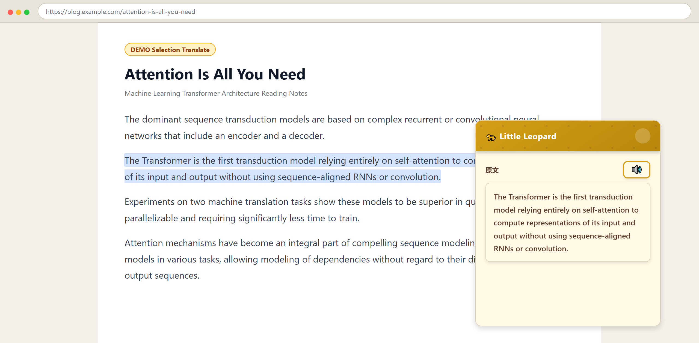
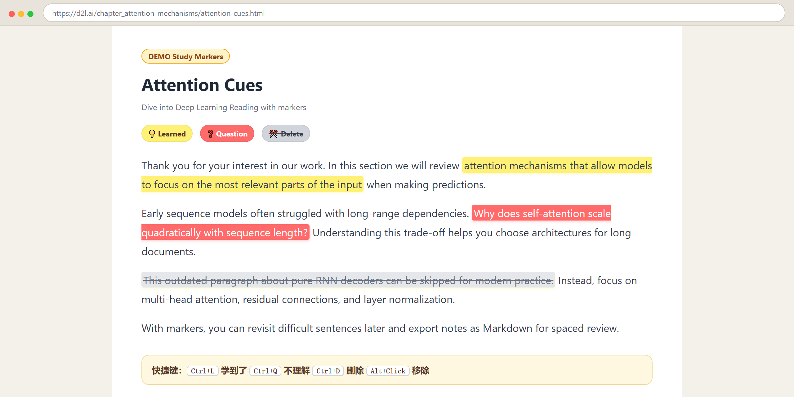
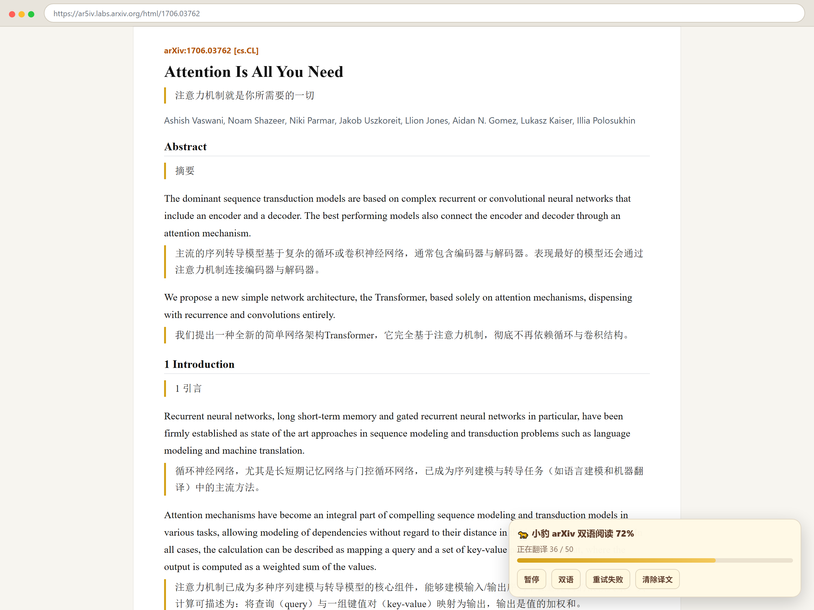
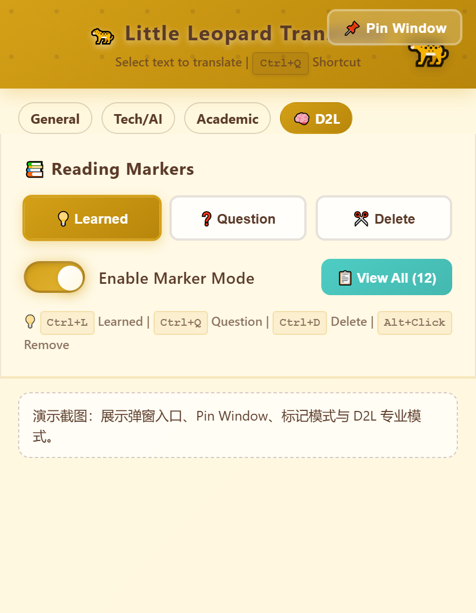

<div align="center">

# 🐆 小豹翻译

**面向学习与阅读的 Chrome 划词翻译扩展**

选中即译 · 学习标记 · 专业术语保护 · arXiv 双语阅读 · PDF 固定窗口

<br />

[](./LICENSE)
[](./manifest.json)
[](https://www.google.com/chrome/)
[](./manifest.json)

<p>
  <a href="#-效果预览">预览</a> ·
  <a href="#-功能特性">功能</a> ·
  <a href="#-安装">安装</a> ·
  <a href="#-使用方法">使用</a> ·
  <a href="#-快捷键">快捷键</a> ·
  <a href="#-项目结构">结构</a> ·
  <a href="#-贡献指南">贡献</a> ·
  <a href="#-开源协议">协议</a>
</p>

</div>

---

## 📖 简介

**小豹翻译** 是一款 Chrome Manifest V3 扩展，面向网页阅读、论文学习与 PDF 场景：

- 任意网页 **划词翻译**，支持中英互译
- **学习标记**（学到了 / 不理解 / 删除），可导出 Markdown
- **专业模式**（Tech/AI、Academic、D2L），保护深度学习等术语
- **arXiv 双语阅读**：摘要页一键进入 ar5iv HTML，段落级中英对照
- **固定窗口**：适合 PDF 复制粘贴翻译，窗口保持置顶

> 适合：读英文文档、刷论文、学 D2L、做阅读笔记的同学。

---

## 📸 效果预览

| 划词翻译 | 学习标记 |
|:---:|:---:|
|  |  |

| arXiv 双语阅读 | 扩展弹窗 |
|:---:|:---:|
|  |  |

---

## ✨ 功能特性

| 功能 | 说明 |
|------|------|
| 🚀 **极速翻译** | 多源并行请求 + 本地缓存，重复内容几乎秒出 |
| 📚 **学习标记** | 选中即标，支持导出 Markdown 笔记 |
| 🎓 **专业术语** | 400+ 术语保护，D2L / 学术 / Tech 模式 |
| 📄 **arXiv 双语** | 摘要页入口 → ar5iv HTML 段落对照翻译 |
| 📌 **固定窗口** | Pin Window 置顶，方便 PDF 边读边译 |
| 🔊 **双向朗读** | 原文 / 译文均可朗读 |
| 🎨 **豹纹主题** | 统一视觉风格的弹窗与划词框 |

### 翻译模式

- **General** — 通用翻译
- **Tech / AI** — 技术与 AI 术语保护
- **Academic** — 学术论文语境
- **D2L** — 针对 [《动手学深度学习》](https://zh.d2l.ai/)（访问 `d2l.ai` 等站点时自动启用）

---

## 📦 安装

### 开发者模式加载（推荐）

1. 克隆或下载本仓库：

```bash
git clone https://github.com/xiaotuzizuibang/little-leopard.git
cd little-leopard
```

2. 打开 Chrome，访问：`chrome://extensions/`
3. 打开右上角 **开发者模式**
4. 点击 **加载已解压的扩展程序**
5. 选择本项目根目录（包含 `manifest.json` 的文件夹）
6. 安装完成，工具栏出现「小豹翻译」图标

> 暂未上架 Chrome 网上应用店，请使用上述方式安装。

---

## 🚀 使用方法

### 网页划词翻译

1. 在任意网页选中文字  
2. 自动弹出翻译框（可拖动标题栏移动位置）  
3. 无选中文字时按 `Ctrl+Q` 可打开翻译入口  
4. 按 `Esc` 或点击 × 关闭

### 学习标记

选中文字后直接使用快捷键（无需先开开关）：

| 操作 | 效果 |
|------|------|
| `Ctrl+L` | 💡 学到了 |
| `Ctrl+Q` | ❓ 不理解（有选中文字时） |
| `Ctrl+D` | ✂️ 删除线 |
| `Alt` + 点击标记 | 移除该标记 |

标记可在扩展内回顾，并导出为 Markdown。

### PDF 翻译

Chrome 内置 PDF 查看器限制较多，推荐：

1. 点击扩展图标 → **📌 Pin Window**
2. 在 PDF 中复制文字（`Ctrl+C`）
3. 在置顶翻译窗口中粘贴并翻译

详见：[PDF 翻译说明](./docs/PDF翻译说明.md)

### arXiv 双语阅读

1. 打开论文摘要页，例如：`https://arxiv.org/abs/xxxx.xxxxx`
2. 页面出现 **双语版** 入口时点击
3. 跳转至 [ar5iv](https://ar5iv.labs.arxiv.org/) HTML 版本
4. 扩展按段落注入中文对照，支持进度、暂停、重试与显示模式切换

### D2L 专业翻译

在以下场景会自动使用 D2L 模式：

- `d2l.ai` / `zh.d2l.ai` / `en.d2l.ai`
- 页面标题含 *Dive into Deep Learning* / *动手学深度学习*

也可在弹窗中手动选择 **🧠 D2L** 模式。

---

## ⌨️ 快捷键

| 快捷键 | 功能 |
|--------|------|
| 选中文字 | 弹出划词翻译框 |
| `Ctrl+Q` | 有选中  标记「不理解」；无选中  打开翻译 |
| `Ctrl+L` | 标记「学到了」 |
| `Ctrl+D` | 标记「删除」 |
| `Alt` + 点击 | 移除单个标记 |
| `Ctrl+Enter` | 弹窗输入框内触发翻译 |
| `Esc` | 关闭翻译框 |

> macOS 可将 `Ctrl` 理解为 `⌘ Command`（扩展内同时监听 `metaKey`）。

更多说明：[快捷键使用说明](./docs/快捷键使用说明.md)

---

## 📁 项目结构

```text
xiaochangyu/
├── manifest.json              # Chrome MV3 扩展配置
├── background.js              # Service Worker（翻译请求、缓存）
├── content.js                 # 划词翻译、快捷键、页面注入
├── popup.html / popup.js      # 扩展弹窗
├── standalone.html            # 固定窗口（Pin Window）
├── history.html               # 历史 / 标记回顾
├── assets/
│   ├── content.css            # 页面内样式
│   ├── popup.css              # 弹窗样式
│   └── icons/                 # 扩展图标
├── scripts/
│   ├── terminology.js         # 术语保护
│   ├── marker.js              # 学习标记
│   ├── arxiv-reader.js        # arXiv / ar5iv 双语阅读
│   └── always-on-top-helper.js
└── docs/                      # 详细文档
```

---

## 📚 文档

| 文档 | 内容 |
|------|------|
| [完整使用指南](./docs/完整使用指南.md) | 安装与功能总览 |
| [学习标记使用指南](./docs/学习标记使用指南.md) | 标记与导出 |
| [D2L 专业翻译说明](./docs/D2L专业翻译使用说明.md) | D2L 模式 |
| [PDF 翻译说明](./docs/PDF翻译说明.md) | PDF 工作流 |
| [术语系统说明](./docs/术语系统说明.md) | 术语保护机制 |
| [性能优化说明](./docs/性能优化说明.md) | 缓存与并行请求 |

---

## 🛠️ 技术说明

- **平台**：Chrome Extension Manifest V3  
- **架构**：`background` Service Worker + `content_scripts` + Popup  
- **翻译**：多源请求（如 Google / MyMemory / LibreTranslate 等）+ 本地缓存  
- **存储**：`chrome.storage`（设置、缓存、标记等）  
- **专项**：`scripts/arxiv-reader.js` 注入 ar5iv 段落对照  

无需 Node 构建：克隆后直接「加载已解压的扩展程序」即可开发调试。

---

## 🤝 贡献指南

欢迎 Issue 与 Pull Request。

1. Fork 本仓库  
2. 创建分支：`git checkout -b feature/your-feature`  
3. 提交改动：`git commit -m "feat: describe your change"`  
4. 推送分支：`git push origin feature/your-feature`  
5. 打开 Pull Request  

建议：

- 改功能前先开 Issue 讨论  
- 保持改动小而清晰  
- 涉及 UI 时尽量附截图  

---

## ❓ 常见问题

**Q: 为什么 PDF 里不能直接划词？**  
A: Chrome 内置 PDF 查看器对内容脚本限制较多。请用 **Pin Window** 复制粘贴翻译。

**Q: 翻译失败或很慢？**  
A: 检查网络；同一句会走缓存。可换网络或稍后重试。

**Q: 快捷键没反应？**  
A: 确认扩展已启用，且页面不是受保护页（如 `chrome://`）。部分站点会占用相同快捷键。

**Q: arXiv 双语入口在哪？**  
A: 在 `arxiv.org/abs/...` 摘要页；HTML 对照在 `ar5iv.labs.arxiv.org/html/...`。

---

## ⚠️ 免声明

- 翻译结果由第三方接口生成，**仅供学习参考**，请勿用于正式出版或关键场景而不加校对。  
- 请遵守目标网站与翻译服务的使用条款。  
- 本扩展不收集个人隐私用于商业用途；数据主要保存在本地浏览器存储中。

---

## 📄 开源协议

本项目基于 [MIT License](./LICENSE) 开源。

---

## 🌟 支持项目

如果小豹翻译对你有帮助，欢迎：

- 给仓库点一个 **Star** ⭐  
- 分享给同学或同事  
- 提交 Bug 或功能建议  

---

<div align="center">

**祝阅读愉快** 🐆

Made with ❤️ for learners and readers

</div>
